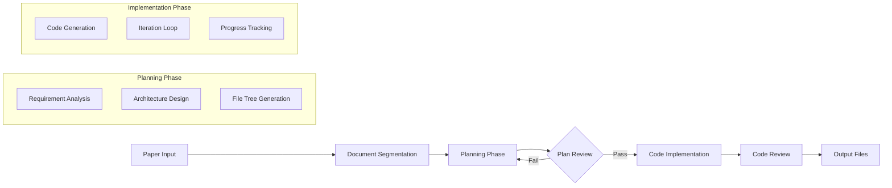

# DeepCode Design — Project Specification

> 本项目为 DeepCode 提供完整的设计规范文档，涵盖多智能体架构、工作流、LLM 提供商、工具系统等核心模块。

---

## 1. Project Overview

- **Project Name**: deepcode-design
- **Project Type**: Design documentation (AI multi-agent code generation system)
- **Core Functionality**: 为 DeepCode 建立统一的设计规范体系
- **Reference Project**: DeepCode (https://github.com/HKUDS/DeepCode)
- **Version**: 1.0.6-jm
- **Last Updated**: 2026-05-12

---

## 2. Architecture Overview

```
┌─────────────────────────────────────────────────────────────────────┐
│                          DeepCode Architecture                        │
├─────────────────────────────────────────────────────────────────────┤
│                                                                     │
│  ┌───────────────┐  ┌───────────────┐  ┌───────────────┐           │
│  │     CLI       │  │    Web UI     │  │   nanobot     │           │
│  │  (Terminal)   │  │  (Dashboard)  │  │  (Feishu)     │           │
│  └───────┬───────┘  └───────┬───────┘  └───────┬───────┘           │
│          │                   │                   │                   │
│          └───────────────────┼───────────────────┘                   │
│                              ↓                                       │
│  ┌───────────────────────────────────────────────────────────────┐  │
│  │                    API Server Layer                             │  │
│  │  ┌─────────┐  ┌─────────┐  ┌─────────┐  ┌─────────┐        │  │
│  │  │Sessions │  │Workflows│  │  Files  │  │  Tasks   │        │  │
│  │  └─────────┘  └─────────┘  └─────────┘  └─────────┘        │  │
│  └───────────────────────────────────────────────────────────────┘  │
│                              ↓                                       │
│  ┌───────────────────────────────────────────────────────────────┐  │
│  │                 Orchestration Engine (Agent)                    │  │
│  │  ┌─────────────────────────────────────────────────────────┐  │  │
│  │  │ 7 Specialized Agents                                     │  │  │
│  │  │ 1. Research Analysis Agent                               │  │  │
│  │  │ 2. Workspace Infrastructure Agent                       │  │  │
│  │  │ 3. Code Architecture Agent                               │  │  │
│  │  │ 4. Reference Intelligence Agent                         │  │  │
│  │  │ 5. Repository Acquisition Agent                          │  │  │
│  │  │ 6. Codebase Intelligence Agent                          │  │  │
│  │  │ 7. Code Implementation Agent                            │  │  │
│  │  └─────────────────────────────────────────────────────────┘  │  │
│  └───────────────────────────────────────────────────────────────┘  │
│                              ↓                                       │
│  ┌───────────────────────────────────────────────────────────────┐  │
│  │                 LLM Provider Layer                             │  │
│  │  ┌──────────┐  ┌──────────┐  ┌──────────┐  ┌──────────┐    │  │
│  │  │  OpenAI  │  │Anthropic │  │ OpenRouter│ │   ...    │    │  │
│  │  └──────────┘  └──────────┘  └──────────┘  └──────────┘    │  │
│  └───────────────────────────────────────────────────────────────┘  │
│                              ↓                                       │
│  ┌───────────────────────────────────────────────────────────────┐  │
│  │                    Tool System Layer                            │  │
│  │  ┌────────────┐  ┌────────────┐  ┌────────────┐              │  │
│  │  │PDF Tools   │  │  Code Tools │  │  Git Tools │              │  │
│  │  └────────────┘  └────────────┘  └────────────┘              │  │
│  └───────────────────────────────────────────────────────────────┘  │
└─────────────────────────────────────────────────────────────────────┘
```

---

## 3. Core Modules

| Module | Document | Description | Status |
|--------|----------|-------------|--------|
| Multi-Agent System | `multi-agent-architecture.md` | 7 Agent 协作架构、通信协议 | ✅ |
| LLM Provider | `provider-architecture.md` | OpenAI/Anthropic/OpenRouter 抽象层 | ✅ |
| Workflow | `workflow-architecture.md` | Paper-to-Code 完整工作流 | ✅ |
| Session Management | `session-management.md` | 持久化会话、状态管理 | ✅ |
| Tool System | `tool-system.md` | MCP 工具注册、执行、结果持久化 | ✅ |
| Configuration | `configuration.md` | 配置管理、API Key、环境变量 | ✅ |

---

## 4. Agent System (7 Agents)

| Agent | Role | Core Function |
|-------|------|---------------|
| Research Analysis Agent | 内容分析与提取 | PDF 解析、文档分割 |
| Workspace Infrastructure Agent | 环境搭建 | 目录结构、依赖管理 |
| Code Architecture Agent | 代码规划 | 实现方案、文件树 |
| Reference Intelligence Agent | 知识发现 | 参考代码检索 |
| Repository Acquisition Agent | 仓库管理 | Git 操作、代码获取 |
| Codebase Intelligence Agent | 关系分析 | 代码索引、依赖图 |
| Code Implementation Agent | 代码生成 | 迭代开发、测试验证 |

---

## 5. Workflow Pipeline



---

## 6. Data Flow

```
User Request (CLI/Web/nanobot)
    ↓
API Server (FastAPI)
    ↓
WorkflowContext
    ↓
Orchestration Engine
    ↓
┌─────────────────────────────────────────┐
│  Parallel Agent Execution               │
│  ┌─────────┐ ┌─────────┐ ┌─────────┐  │
│  │Planning │ │Research │ │Implement│  │
│  │ Runtime │ │ Runtime │ │ Runtime │  │
│  └────┬────┘ └────┬────┘ └────┬────┘  │
│       └───────────┼───────────┘       │
│               ↓                       │
│         Agent Runner                   │
│               ↓                       │
│         LLM Provider                   │
└─────────────────────────────────────────┘
    ↓
Session Persistence (JSONL)
    ↓
Response + Logs
```

---

## 7. Key Design Decisions

### 7.1 MCP (Model Context Protocol)

DeepCode 采用 MCP 架构实现工具调用标准化：

- **MCP Server**: 各工具独立 server（code_implementation_server, document_segmentation_server）
- **MCP Client**: 通过 compat layer 调用
- **配置**: deepcode_config.json 单一配置源

### 7.2 Provider Abstraction

统一 LLM Provider 接口，支持多种后端：

```python
class LLMProvider(ABC):
    async def generate(self, messages, **kwargs) -> LLMResponse
    async def stream(self, messages, **kwargs) -> AsyncIterator[LLMResponse]
```

### 7.3 Session Persistence

所有交互持久化到 JSONL 文件：

```
~/.deepcode/sessions/<session_id>/
├── session.jsonl       # 完整会话历史
├── deepcode_lab/
│   └── tasks/<task_id>/
│       ├── logs/       # 结构化日志
│       └── workspace/   # 工作区文件
```

---

## 8. Acceptance Criteria

- [x] SPEC.md — 项目设计规范主文档 ✅
- [x] README.md — 文档导航索引 ✅
- [x] multi-agent-architecture.md — 多智能体架构设计 ✅
- [x] provider-architecture.md — LLM 提供商架构设计 ✅
- [x] workflow-architecture.md — 工作流架构设计 ✅
- [x] session-management.md — 会话管理设计 ✅
- [x] tool-system.md — 工具系统设计 ✅
- [x] index.html — Web 单页入口 ✅
- [x] 每个模块包含完整接口规范 ✅
- [x] 多智能体协作流程图（Mermaid）✅
