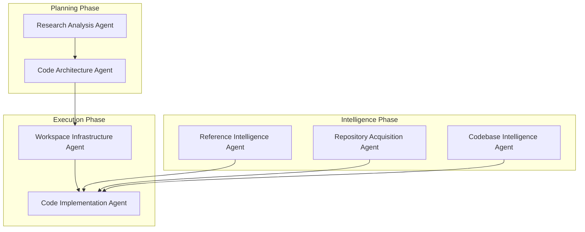
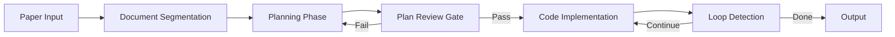

# Multi-Agent Architecture

> DeepCode 多智能体系统架构设计

## 1. Overview

DeepCode 采用 **7 Agent** 的多智能体协作架构，专门用于将研究论文自动转化为可运行的代码实现。

## 2. Agent System (7 Agents)



### 2.1 Agent Specifications

| Agent | Class | Role | Core Function |
|-------|-------|------|---------------|
| Research Analysis Agent | `ResearchAnalysisAgent` | 内容分析与提取 | PDF 解析、文档分割 |
| Workspace Infrastructure Agent | `WorkspaceInfraAgent` | 环境搭建 | 目录结构、依赖管理 |
| Code Architecture Agent | `CodeArchitectureAgent` | 代码规划 | 实现方案、文件树 |
| Reference Intelligence Agent | `ReferenceIntelligenceAgent` | 知识发现 | 参考代码检索 |
| Repository Acquisition Agent | `RepoAcquisitionAgent` | 仓库管理 | Git 操作、代码获取 |
| Codebase Intelligence Agent | `CodebaseIntelligenceAgent` | 关系分析 | 代码索引、依赖图 |
| Code Implementation Agent | `CodeImplementationAgent` | 代码生成 | 迭代开发、测试验证 |

---

## 3. Agent Runtime

### 3.1 Core Components

```
core/agent_runtime/
├── runner.py          # 共享执行循环 (Tool-using agent)
├── runtime.py         # LLM 运行时接口
├── helpers.py         # 消息构建、token 估计、截断
├── hook.py           # Agent 钩子系统
└── tools/
    └── registry.py    # 工具注册表
```

### 3.2 AgentRunSpec

```python
@dataclass(slots=True)
class AgentRunSpec:
    """Configuration for a single agent execution."""
    initial_messages: list[dict[str, Any]]
    tools: ToolRegistry
    model: str
    max_iterations: int
    max_tool_result_chars: int
    temperature: float | None = None
    max_tokens: int | None = None
    reasoning_effort: str | None = None
    hook: AgentHook | None = None
    concurrent_tools: bool = False
    fail_on_tool_error: bool = False
    workspace: Path | None = None
    session_key: str | None = None
    context_window_tokens: int | None = None
```

### 3.3 AgentRunResult

```python
@dataclass(slots=True)
class AgentRunResult:
    """Outcome of a shared agent execution."""
    final_message: str
    tool_calls: list[ToolCallRequest]
    duration_s: float
    iterations: int
    tokens_used: dict[str, int]
    errors: list[str]
```

---

## 4. Orchestration Engine

### 4.1 Agent Orchestration Engine

```python
class AgentOrchestrationEngine:
    """核心编排引擎，协调多个专业 AI Agent"""
    
    async def run_workflow(
        self,
        paper_path: str,
        task_id: str,
        session_id: str,
        models: dict[str, str]
    ) -> WorkflowResult:
        # 1. 研究分析
        # 2. 环境准备
        # 3. 架构规划
        # 4. 代码实现
        # 5. 结果汇总
```

### 4.2 Workflow Pipeline



### 4.3 Loop Detection

```python
class LoopDetector:
    """防止无限循环的检测系统"""
    
    MAX_CONSECUTIVE_ERRORS = 10
    MAX_ITERATIONS = 50
    STALL_THRESHOLD_S = 300
    
    def should_abort(self, state: LoopState) -> bool:
        """判断是否应该终止执行"""
        ...
```

### 4.4 Progress Tracking

```python
class ProgressTracker:
    """8 阶段进度跟踪 (5% → 100%)"""
    
    PHASES = [
        "INIT",           # 0-5%
        "SEGMENTATION",   # 5-15%
        "PLANNING",       # 15-25%
        "PLAN_REVIEW",    # 25-30%
        "IMPLEMENTATION", # 30-80%
        "REVIEW",         # 80-90%
        "FINALIZATION",   # 90-95%
        "COMPLETE",       # 95-100%
    ]
```

---

## 5. Communication Protocol

### 5.1 Message Format

```python
@dataclass
class AgentMessage:
    sender: str           # Agent ID
    receiver: str         # Agent ID or "broadcast"
    message_type: str     # REQUEST, RESPONSE, ERROR
    content: dict         # Message payload
    timestamp: datetime
    conversation_id: str  # For tracing
```

### 5.2 Message Types

| Type | Direction | Description |
|------|-----------|-------------|
| `PAPER_ANALYSIS_REQUEST` | Orchestrator → Research Agent | 请求论文分析 |
| `SEGMENTATION_COMPLETE` | Research Agent → Orchestrator | 分割完成 |
| `PLAN_REQUEST` | Orchestrator → Architecture Agent | 请求规划 |
| `PLAN_REVIEW_GATE` | Architecture Agent → Review | 计划审查 |
| `IMPLEMENTATION_REQUEST` | Orchestrator → Implementation Agent | 请求实现 |
| `TOOL_CALL` | Agent → Tool System | 工具调用 |
| `ERROR` | Any → Any | 错误通知 |

---

## 6. Execution Context

### 6.1 WorkflowContext

```python
@dataclass
class WorkflowContext:
    """工作流执行上下文"""
    task_id: str
    session_id: str
    paper_path: str
    workspace_path: Path
    models: ModelSelection
    config: DeepCodeConfig
    progress: ProgressTracker
    loop_detector: LoopDetector
    checkpoint_callback: Callable
```

### 6.2 State Management

```python
class WorkflowState(Enum):
    PENDING = "pending"
    RUNNING = "running"
    WAITING_FOR_INPUT = "waiting_for_input"
    COMPLETED = "completed"
    ABORTED = "aborted"
    FAILED = "failed"
```

---

## 7. Error Handling

### 7.1 Retry Strategy

| Error Type | Retry Count | Backoff |
|------------|-------------|---------|
| Network Timeout | 3 | Exponential |
| Rate Limit | 5 | Linear |
| API Error | 2 | Constant |
| Agent Timeout | 1 | None |

### 7.2 Fallback Mechanism

```python
class AgentFallback:
    def handle_failure(self, agent: str, error: Error) -> Any:
        if agent == "research_analysis":
            return self._fallback_to_direct_extraction()
        elif agent == "code_implementation":
            return self._fallback_to_simplified_generation()
        else:
            raise MaxRetriesExceeded(agent, error)
```

---

## 8. API Interface

### 8.1 Workflow Execution

```python
# POST /api/v1/workflows/paper-to-code
{
    "paper_path": "/path/to/paper.pdf",
    "models": {
        "default": "gpt-4o",
        "planning": "gpt-4o",
        "implementation": "claude-sonnet-4"
    },
    "session_id": "session_xxx"  # optional
}

# Response
{
    "success": true,
    "task_id": "task_xxx",
    "session_id": "session_xxx",
    "status": "running",
    "progress": 35
}
```

### 8.2 Task Status

```python
# GET /api/v1/tasks/{task_id}/status
{
    "task_id": "task_xxx",
    "status": "running",
    "phase": "IMPLEMENTATION",
    "progress": 67,
    "files_completed": 8,
    "total_files": 12,
    "current_file": "models/transformer.py",
    "errors": []
}
```

---

## 9. Implementation Notes

### 9.1 Key Files

| File | Purpose |
|------|---------|
| `core/agent_runtime/runner.py` | Agent 共享执行循环 |
| `workflows/agent_orchestration_engine.py` | 核心编排引擎 (93KB) |
| `workflows/code_implementation_workflow.py` | 代码实现工作流 |
| `workflows/planning_runtime.py` | 规划运行时 |
| `workflows/plan_review_runtime.py` | 计划审查运行时 |
| `core/providers/base.py` | LLM Provider 抽象 |

### 9.2 Known Constraints

- nanobot 集成需要 Feishu 平台支持
- PDF 转换依赖 LibreOffice（Docker 模式自动安装）
- 代码索引需要代码库结构，简单的单文件可能跳过索引步骤
- Windows 环境使用 Docker 模式，本地模式部分功能受限
