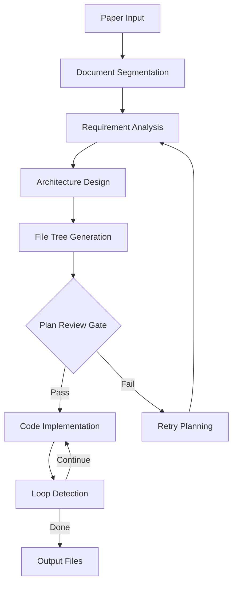

# Workflow Architecture

> DeepCode Paper-to-Code 工作流架构设计

## 1. Overview

DeepCode 的核心工作流是将研究论文自动转化为可运行的代码实现，整个流程分为多个阶段：文档分割、规划、计划审查、代码实现。



---

## 2. Workflow Pipeline

### 2.1 Pipeline Stages

| Stage | Phase | Description | Output |
|-------|-------|-------------|--------|
| 1 | Document Segmentation | 将长论文分割成可处理的块 | `segments/` |
| 2 | Requirement Analysis | 分析需求和功能点 | `requirements.md` |
| 3 | Architecture Design | 设计代码架构 | `architecture.md` |
| 4 | File Tree Generation | 生成目录结构 | `file_tree.json` |
| 5 | Plan Review | 审查计划可行性 | `review_result` |
| 6 | Code Implementation | 迭代生成代码 | `output/` |
| 7 | Code Review | 审查生成质量 | `review_report` |

### 2.2 Code Implementation Workflow

```python
class CodeImplementationWorkflow:
    """Paper Code Implementation Workflow Manager"""
    
    async def run_workflow(
        self,
        paper_path: str,
        plan_file: str,
        output_dir: str,
        models: dict[str, str]
    ) -> ImplementationResult:
        # 1. 读取计划
        plan = self._read_plan_file(plan_file)
        
        # 2. 检查文件树
        if not self._check_file_tree_exists(output_dir):
            # 生成文件树
            await self._generate_file_tree(plan)
        
        # 3. 迭代实现
        await self._pure_code_implementation_loop(
            plan, output_dir, models
        )
```

---

## 3. Planning Phase

### 3.1 Planning Runtime

```python
class PlanningRuntime:
    """规划阶段运行时"""
    
    async def plan(
        self,
        segments: list[DocumentSegment],
        model: str,
        session_id: str
    ) -> PlanningResult:
        # 1. 构建规划提示
        prompt = self._build_planning_prompt(segments)
        
        # 2. 调用 LLM 生成规划
        response = await self._llm.generate(prompt)
        
        # 3. 解析规划结果
        plan = self._parse_planning_response(response)
        
        # 4. 持久化检查点
        await self._save_checkpoint(plan, session_id)
        
        return plan
```

### 3.2 Plan Review Gate

```python
class PlanReviewRuntime:
    """计划审查运行时"""
    
    async def review(
        self,
        plan: Plan,
        review_model: str
    ) -> PlanReviewResult:
        # 构建审查提示
        prompt = self._build_review_prompt(plan)
        
        # 调用审查 LLM
        response = await self._llm.generate(prompt)
        
        # 解析审查结果
        result = self._parse_review_response(response)
        
        if not result.is_approved:
            # 增加重试计数
            result.retry_count += 1
            
        return result
    
    async def run_plan_review_gate(
        self,
        plan: Plan,
        review_model: str
    ) -> bool:
        """运行计划审查门控"""
        result = await self.review(plan, review_model)
        
        if result.is_approved:
            return True
        
        if result.retry_count >= MAX_PLAN_RETRIES:
            raise PlanReviewMaxRetriesExceeded()
        
        return False
```

### 3.3 Checkpoint System

```python
class PlanningCheckpointCallback:
    """规划检查点回调"""
    
    def __call__(self, checkpoint_data: dict) -> None:
        plan_text = checkpoint_data.get("plan_text", "")
        checkpoint_dir = self._get_checkpoint_dir()
        
        # 保存检查点
        checkpoint_file = checkpoint_dir / "planning_checkpoint.json"
        with open(checkpoint_file, "w") as f:
            json.dump(checkpoint_data, f)
        
        # 保存规划文本
        plan_file = checkpoint_dir / "current_plan.txt"
        with open(plan_file, "w") as f:
            f.write(plan_text)

def read_planning_meta(session_id: str) -> dict | None:
    """读取规划元数据"""
    meta_file = Path(f"~/.deepcode/sessions/{session_id}/planning_meta.json")
    if meta_file.exists():
        return json.loads(meta_file.read_text())
    return None
```

---

## 4. Implementation Phase

### 4.1 Code Implementation Loop

```python
async def _pure_code_implementation_loop(
    self,
    plan: str,
    output_dir: str,
    models: dict[str, str]
) -> None:
    """纯代码实现循环"""
    
    file_list = self._extract_file_list(plan)
    self._last_run_state["total_files"] = len(file_list)
    
    for file_info in file_list:
        # 检查是否应该停止
        if self.loop_detector.should_abort():
            break
        
        try:
            # 实现单个文件
            await self._implement_single_file(
                file_info, output_dir, models
            )
            self._last_run_state["files_completed"] += 1
            
        except Exception as e:
            self._handle_implementation_error(e, file_info)
    
    # 更新最终状态
    self._last_run_state["status"] = "completed"
```

### 4.2 Loop Detection

```python
class LoopDetector:
    """循环检测器"""
    
    def __init__(self):
        self.consecutive_errors = 0
        self.repeat_patterns = []
        self.last_progress_time = time.time()
        self.start_time = time.time()
    
    def should_abort(self) -> bool:
        """判断是否应该终止"""
        # 检查连续错误
        if self.consecutive_errors >= self.MAX_CONSECUTIVE_ERRORS:
            return True
        
        # 检查超时
        elapsed = time.time() - self.start_time
        if elapsed > self.MAX_RUNTIME_S:
            return True
        
        # 检查进度停滞
        if time.time() - self.last_progress_time > self.STALL_THRESHOLD_S:
            return True
        
        return False
    
    def record_progress(self) -> None:
        """记录进度（用于检测停滞）"""
        self.last_progress_time = time.time()
```

### 4.3 Progress Tracking

```python
class ProgressTracker:
    """进度跟踪器"""
    
    PHASES = [
        ("INIT", 0, 5),
        ("SEGMENTATION", 5, 15),
        ("PLANNING", 15, 25),
        ("PLAN_REVIEW", 25, 30),
        ("IMPLEMENTATION", 30, 80),
        ("REVIEW", 80, 90),
        ("FINALIZATION", 90, 95),
        ("COMPLETE", 95, 100),
    ]
    
    def get_overall_progress(self) -> int:
        """获取总体进度"""
        phase, start, end = self._get_current_phase()
        return start
    
    def _get_current_phase(self) -> tuple[str, int, int]:
        """获取当前阶段"""
        for name, start, end in self.PHASES:
            if start <= self.overall_progress < end:
                return name, start, end
        return ("COMPLETE", 95, 100)
```

---

## 5. Document Segmentation

### 5.1 Segmentation Agent

```python
class DocumentSegmentationAgent:
    """文档分割 Agent"""
    
    def __init__(self, chunk_size: int = 50000):
        self.chunk_size = chunk_size  # 字符数
    
    async def segment(
        self,
        document: str,
        task_id: str
    ) -> list[DocumentSegment]:
        # 1. 检查是否需要分割
        if len(document) < self.chunk_size:
            return [DocumentSegment(content=document, index=0)]
        
        # 2. 语义分割
        segments = self._semantic_split(document)
        
        # 3. 创建段元数据
        return [
            DocumentSegment(
                content=seg,
                index=i,
                start_char=offsets[i],
                end_char=offsets[i+1]
            )
            for i, seg in enumerate(segments)
        ]
```

### 5.2 Segmentation Server

```python
# tools/document_segmentation_server.py
class DocumentSegmentationServer:
    """文档分割 MCP Server"""
    
    async def segment_document(
        self,
        paper_path: str,
        chunk_size: int = 50000
    ) -> dict:
        # 读取文档
        with open(paper_path, "r", encoding="utf-8") as f:
            content = f.read()
        
        # 分割
        segments = await self._segment(content, chunk_size)
        
        # 保存
        output_dir = Path(paper_path).parent / "segments"
        output_dir.mkdir(exist_ok=True)
        
        for i, seg in enumerate(segments):
            seg_file = output_dir / f"segment_{i:03d}.txt"
            seg_file.write_text(seg.content)
        
        return {
            "segments": len(segments),
            "output_dir": str(output_dir)
        }
```

---

## 6. Code Generation

### 6.1 Structure Generator

```python
class StructureGenerator:
    """文件结构生成器"""
    
    PROMPT_TEMPLATE = """
    Based on the following research paper summary and requirements:
    
    {requirements}
    
    Generate a file tree structure for the implementation.
    
    Output format (JSON):
    {{
        "files": [
            {{
                "path": "src/models/transformer.py",
                "description": "Transformer model implementation",
                "dependencies": ["src/utils/layers.py"],
                "priority": 1
            }}
        ]
    }}
    """
```

### 6.2 Code Implementation Agent

```python
class CodeImplementationAgent:
    """代码实现 Agent"""
    
    async def generate_file(
        self,
        file_spec: FileSpec,
        context: dict,
        model: str
    ) -> str:
        # 构建提示
        prompt = self._build_implementation_prompt(
            file_spec, context
        )
        
        # 调用 LLM
        response = await self._llm.generate(
            messages=[{"role": "user", "content": prompt}],
            model=model,
            temperature=0.3
        )
        
        # 解析和验证
        code = self._extract_code(response)
        self._validate_syntax(code, file_spec.path)
        
        return code
```

---

## 7. Workspace Management

### 7.1 Environment Preparation

```python
class WorkflowEnvironment:
    """工作流环境管理"""
    
    async def prepare(
        self,
        task_id: str,
        session_id: str
    ) -> Path:
        # 创建工作目录
        workspace = Path(f"~/.deepcode/sessions/{session_id}/tasks/{task_id}/workspace")
        workspace.mkdir(parents=True, exist_ok=True)
        
        # 创建日志目录
        log_dir = workspace / "logs"
        log_dir.mkdir(exist_ok=True)
        
        # 初始化配置
        await self._init_config(workspace)
        
        return workspace
```

### 7.2 File Tree Creation

```python
class FileTreeCreator:
    """文件树创建器"""
    
    def create_from_spec(
        self,
        spec: FileTreeSpec,
        base_path: Path
    ) -> None:
        for file_spec in spec.files:
            file_path = base_path / file_spec.path
            
            # 创建父目录
            file_path.parent.mkdir(parents=True, exist_ok=True)
            
            # 创建文件
            if not file_path.exists():
                file_path.touch()
            
            # 添加依赖注释
            if file_spec.dependencies:
                self._add_dependency_comments(file_path, file_spec.dependencies)
```

---

## 8. API Interface

### 8.1 Start Workflow

```python
# POST /api/v1/workflows/paper-to-code
{
    "paper_path": "/path/to/paper.pdf",
    "options": {
        "segmentation_chunk_size": 50000,
        "max_plan_retries": 3,
        "enable_review_gate": true
    }
}

# Response
{
    "success": true,
    "task_id": "task_xxx",
    "session_id": "session_xxx",
    "status": "running",
    "message": "Workflow started"
}
```

### 8.2 Get Progress

```python
# GET /api/v1/tasks/{task_id}/progress
{
    "task_id": "task_xxx",
    "status": "running",
    "phase": "IMPLEMENTATION",
    "progress": 67,
    "current_file": "models/transformer.py",
    "files_completed": 8,
    "total_files": 12,
    "errors": [],
    "estimated_remaining": "5m"
}
```

### 8.3 WebSocket Streaming

```python
# WebSocket /ws/tasks/{task_id}/logs?channel=llm
{
    "type": "log",
    "channel": "llm",
    "timestamp": "2026-05-12T10:30:00Z",
    "data": {
        "message": "Generating models/transformer.py...",
        "tokens_used": {"input": 1500, "output": 300},
        "cost": 0.05
    }
}
```

---

## 9. Implementation Notes

### 9.1 Key Files

| File | Purpose |
|------|---------|
| `workflows/agent_orchestration_engine.py` | 核心编排引擎 (93KB) |
| `workflows/code_implementation_workflow.py` | 代码实现工作流 (50KB) |
| `workflows/code_implementation_workflow_index.py` | 带索引的实现工作流 |
| `workflows/planning_runtime.py` | 规划运行时 |
| `workflows/plan_review_runtime.py` | 计划审查运行时 |
| `workflows/environment.py` | 工作流环境管理 |
| `tools/document_segmentation_server.py` | 文档分割服务 (73KB) |

### 9.2 Known Constraints

- 计划审查门控可配置，禁用后直接进入实现阶段
- 循环检测基于错误计数、超时、进度停滞三个维度
- 文档分割阈值可通过 `segmentation_chunk_size` 配置
- 工作区文件在任务完成后保留，仅 session 删除时清理
